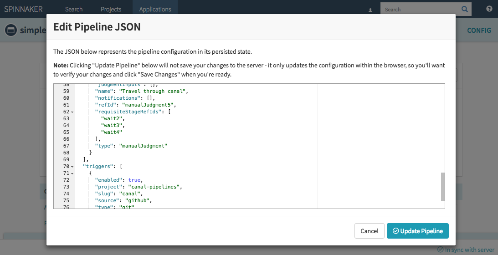
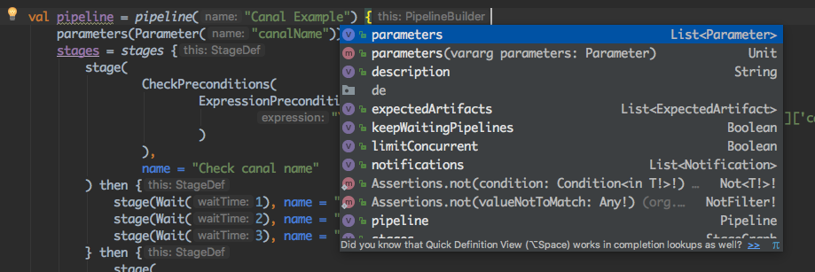

# Canal Spinnaker Pipeline DSL

> **Canal** - *an artificial waterway constructed to allow the passage of boats or ships out to sea*

Spinnaker pipelines are a great way to deploy your services to the cloud. There is already a beautiful UI for creating them and watching them execute.


Many people use the JSON representation of a pipeline as the source of truth for their pipelines in version control. But pipelines often get complicated and the JSON can get unruly. 



Canal allows you to actually write your pipeline description as code.
* Use common programming constructs (loops, conditionals, composition...) for conciseness, reduced duplication, and reuse.
* A compiler and IDE assistance help validate your pipeline as you write it.
* Unit tests can make assertions on your pipeline structure and expression evaluations.



If you have ever modified the pipeline JSON directly you will immediately notice how much simpler the pipeline definition below is over the [equivalent JSON](https://github.com/canal-pipelines/canal/blob/04d8a02675bf72e5c872f86143f7f07b07d4955f/src/test/kotlin/io/pivotal/canal/CanalExample.kt#L19).
* No longer required to maintain the tedious 'refId' and 'requisiteStageRefIds' relationships. Instead, build the stage graph implicitly with 'then' blocks.
* Based on class and method definitions, gain an understanding of what attributes are available and which of those are required. The duplicate and unnecessary attributes are hidden from you.
* Use String interpolation and any language feature of [Kotlin](https://kotlinlang.org/) when writing your pipelines.

```kotlin
pipeline("Canal Example") {
    parameters(Parameter("canalName"))
    stages = stages {
        stage(
                CheckPreconditions(
                        ExpressionPrecondition(
                                "\${ {'Corinth', 'Panama', 'Suez'}.contains(trigger['parameters']['canalName']) }"
                        )
                ),
                name = "Check canal name"
        ) then {
            stage(Wait(1), name = "Wait for decent weather")
            stage(Wait(2), name = "Wait for reservation #${reservationNumber}")
            stage(Wait(3), name = "Wait for lock to open")
        } then {
            stage(
                    ManualJudgment(),
                    name = "Travel through canal"
            )
        }
    }
    triggers(
            GitHubTrigger(
                    org = "canal-pipelines",
                    repo = "canal"
            )
    )
}
```

You can already use [Spring Expression Language (SpEL)](https://docs.spring.io/spring/docs/4.3.10.RELEASE/spring-framework-reference/html/expressions.html) in your pipeline to dynamically evaluate certain values. It can, however, be difficult to understand the results of more complicated expressions or even confirm they are valid. With Canal you can unit test the structure of your resulting pipeline including expression evaluations given a specific pipeline execution context.

```kotlin
val pipelineExecution = PipelineExecution(
        mapOf(
                "parameters" to mapOf(
                        "canalName" to "Panama"
                )
        )
)
val evaluator = ExpressionEvaluator(pipelineExecution)

val evaluatedPipeline = evaluator.evaluate(pipeline)

assertThat(evaluatedPipeline.stageGraph.stages[0].stageConfig)
        .isEqualTo(CheckPreconditions(ExpressionPrecondition(true)))
```

Note that the example above is contrived. A real pipeline would likely involve triggering based on commit hooks, building an artifact, deploying that through environments (like test, stage, prod), and running integration tests along the way. This example was kept simple so that it could be put into Spinnaker and run quickly and without any modifications. Check out the unit tests for more examples.
